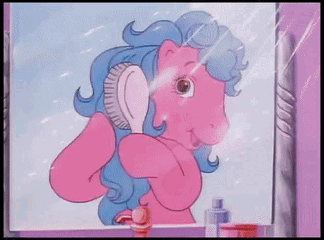

# 🦄

# BASIC HAIR SET UP

#### Not like this!

[]()

<br>
<br>
<br>

## CREATE A SPHERE AND ADD SOME HAIR TO IT

[]()

##### The Hair isn't the complicated part but the conversion and then the export to the threejs scene, we will see that later, first lets create the sphere and then add some hair.

###### This are the steps to follow to convert it:

[Convert Cycles Hair Particle System to Mesh Object ](https://blender.stackexchange.com/questions/2745/convert-cycles-hair-particle-system-to-mesh-object/5255#5255)

- select object that has hair
- select convert Particle Modifier on modifiers tab
- remove particle system under particles tab
- select converted hair mesh
- add screw Modifier with .1 degrees for angle and 2 steps
  > if vertex count is too high, Add Decimate Modifier with planar apply all modifiers

```javascript

```
