# 🦄

# BASIC HAIR SET UP with Blender/threejs

- I want to add some hairy/fury model to my threejs scene, I have seen advanced tutorials about how to make it in threejs without Blender, but I think I still need to learn a lot before diving into such code, so I will try my best to make it with blender.

[Fuzzy Meshes | MEDIUM](https://medium.com/@Zadvorsky/fuzzy-meshes-4c7fd3910d6f)

[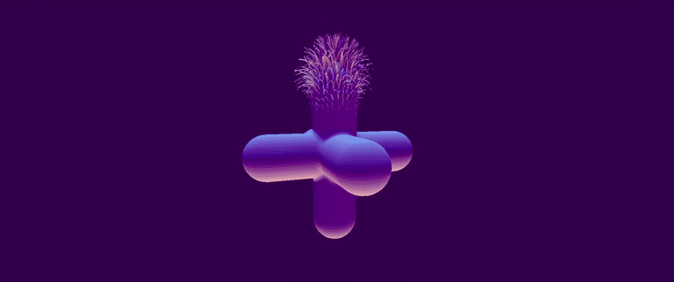](https://medium.com/@Zadvorsky/fuzzy-meshes-4c7fd3910d6f)

<br>

## CREATE A SPHERE AND ADD SOME HAIR TO IT

[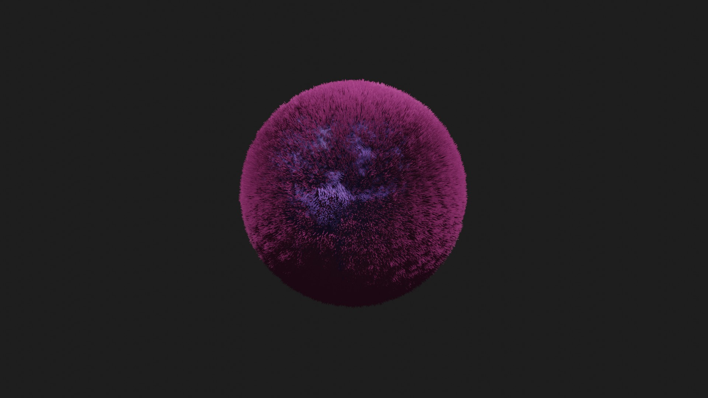](https://youtu.be/nMULgZREpMw)

##### The Hair isn't the complicated part but the conversion and then the export to the threejs scene, we will see that later, first lets create the sphere and then add some hair.

[]()

[]()

- Comb it a little bit

[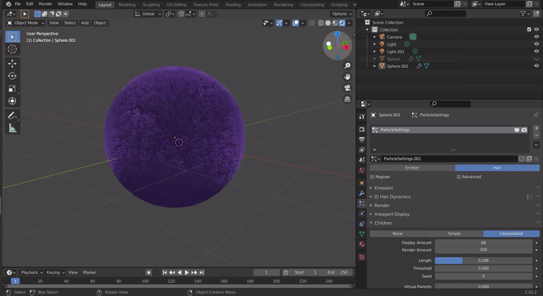]()
[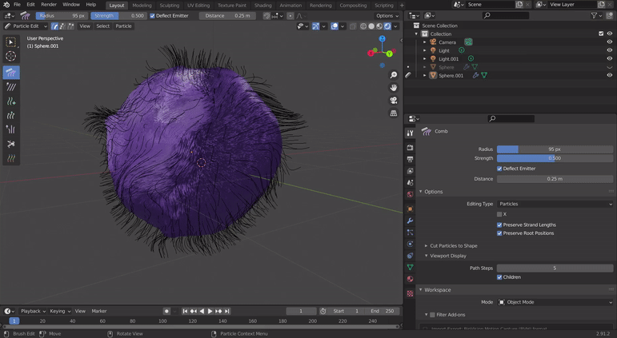]()

<br>

##### Give it a little SUN light (the exported lights from Blender can conflict with the ones in threejs )

- Its the first time I create a Sun light in Blender so it wasnt that bad, even if by logic you dont position the sun in the back of the object lol but I had the 2 lights on the top so I could get a nice effect :)

[]()

<br>

### RESULT Lights

[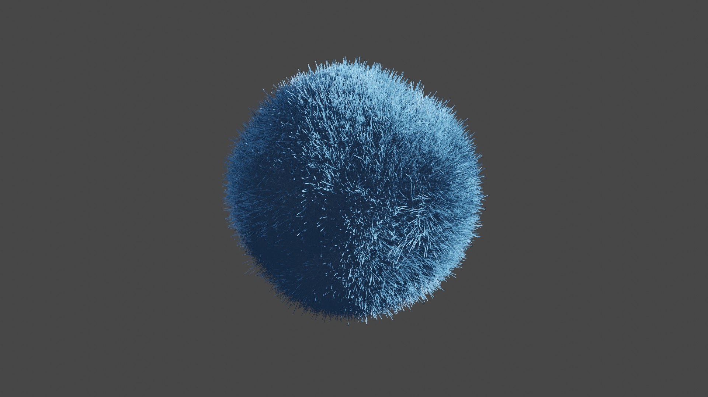](https://youtu.be/S2l1mvU28OQ)

<br>
<br>
<br>

### EXPORT

### Last time I tried i couldn't make it, maybe there's something I am missing? i will try again ...

###### This are the steps to follow to convert it, since I am new in Blender its not that simple:

[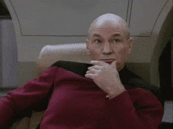]()

[Convert Cycles Hair Particle System to Mesh Object ](https://blender.stackexchange.com/questions/2745/convert-cycles-hair-particle-system-to-mesh-object/5255#5255)

- select object that has hair
- select convert Particle Modifier on modifiers tab
- remove particle system under particles tab
- select converted hair mesh
- add screw Modifier with .1 degrees for angle and 2 steps
  > if vertex count is too high, Add Decimate Modifier with planar apply all modifiers

```javascript

```

<br>
<br>
<br>

### After few hours of searching and testing

- I COULD FINALLY come out with something, but i don't think it s the right way as the models are huge, and the reason for that is due to the fact I am using a hell of meshes.

##### Looks like hair but it s not fluffy enough and is too big.

[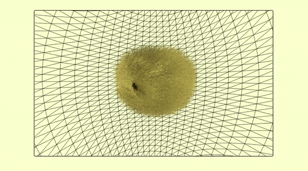]()

<br>

#### Articles and videos that helped to find this first solution:

[how to transfer hair as .obj file](https://blender.stackexchange.com/questions/40912/how-to-transfer-hair-as-obj-file)

[Why I can’t see hair in exported glTF file?](https://blenderartists.org/t/why-i-cant-see-hair-in-exported-gltf-file/1213013)

[How can curves be converted to meshes](https://blender.stackexchange.com/questions/2917/how-can-curves-be-converted-to-meshes)

[Convert Cycles Hair Particle System to Mesh Object](https://blender.stackexchange.com/questions/2745/convert-cycles-hair-particle-system-to-mesh-object/5255#5255)

```javascript
alt - C;
// to convert to Meshes in Blender is deprecated , you have to be under Object and convert to Curve to make appear the babel option.
```

<!-- -

https://www.youtube.com/watch?v=M-PFEAKSxHc

#### The steps ...

After you created the fluffy hair in the sphere
- Move the fluffy  -->

<br>
<br>
<br>

### Using the SCREW MODIFIER

[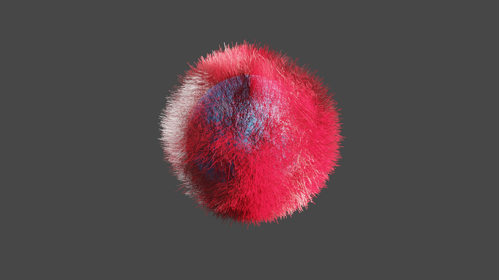]()

###### (how it looks in blender)

<br>

#### I really dont know if it should look like this:

- The hair is too thick and dont look fluffy like in the original sphere.

[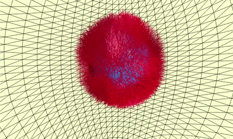]()

<br>
<br>
<br>

### PROCESS (using screw modifier)

[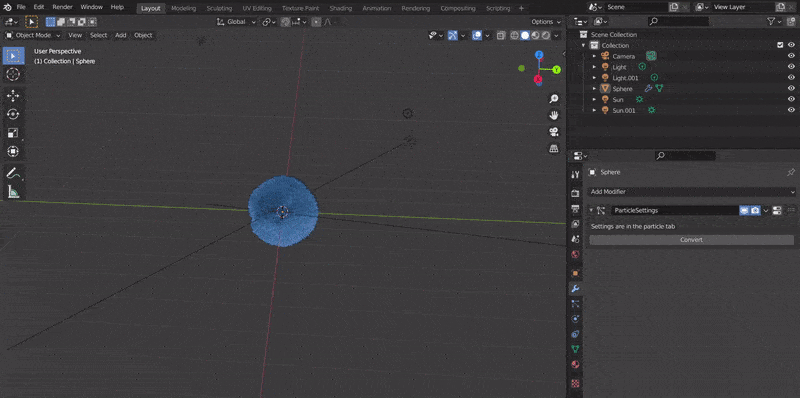](https://www.youtube.com/watch?v=7dGA3jPoQUU)

#### 1) Duplicate the hair from the sphere to convert the "hair particles" to Mesh, so that you can work with the screw Modifier (without this you cant).

- To duplicate-: Press G and then y or x axis (G will make it move and y or x are the directions you want to move).

#### 2) After you add the screw modifier to the duplicated hair (the orange thing), it will open a box with options:

 <br>

**Go to** the Steps Viewport and change the following:

- Change it to 1 or 2
- If you changed it to one the hair ball (orange) will dissappear but dont worry.

**Go to** the Angle option in the same box

- Try to set how thin each hair has to be.
- Between 359° and 360° , knowing that if you go under 359° it will be thick , the same if you go above 360°.

<br>
<br>
<br>

### AT this point

- I am thinking about to just add a velvet looking ground floor using some image texture.

- I am trying all this, because I already have a scene in my mind and I am just looking for a nice and simple way to make it.

<br>
<br>
<br>

##### SO YESTERDAY

- I spend the whole day figuring it out **how to work with the Nodes in Blender** so to do this:

[]()

> I had to **install an extension** to have one of the boxes in the picture, because after reading a couple of articles nobody could tell that you needed to install it first before using the shortcut 🤦, yep **some tutorial confuse you even further**

<br>

**Node Wrangler**

[Node Wrangle | Usage | activation](https://docs.blender.org/manual/en/latest/addons/node/node_wrangler.html)

[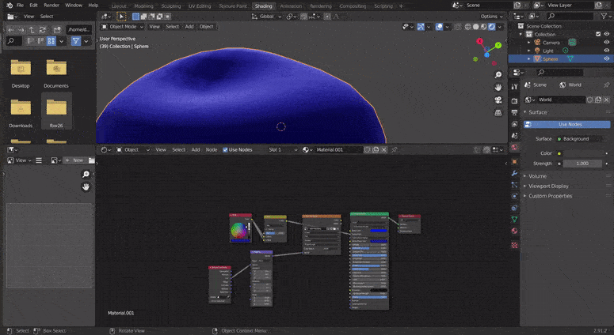]()

- Bump helps you to reach even further the details of the image.

> The Bump node generates a perturbed normal from a height texture, for bump mapping. The height value will be sampled at the shading point and two nearby points on the surface to determine the local direction of the normal.

[]()

[Bump Node](https://docs.blender.org/manual/en/latest/render/shader_nodes/vector/bump.html)

[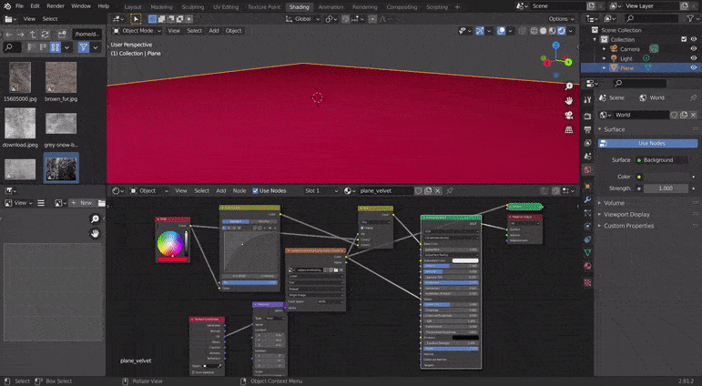]()

#### All seemed perfect until I exported it

- Maybe I am doing something wrong?

- It s exporting it but not completely 🤔

 > **Instead of the red carpet**, I am getting this:

[]()

- Absolutely not what I want

<br>
<br>
<br>

## Another solution 🦄
 
- To simply add an image map to a threejs Geometry, simplier but not the same, I cannot say I am   satisfied with the result because it can be there s something else.

[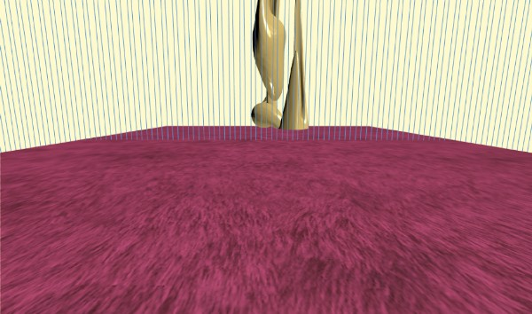]()

```javascript
const loaderImg = new THREE.TextureLoader();

// another way
this.meshFloor = new THREE.Mesh(
  new THREE.PlaneGeometry(18, 18, 50, 50), //, 360, 180)
  new THREE.MeshPhongMaterial({
    shininess: 0.8,
    roughness: 5,
    // color to the img Fur
    color: 0xfb225d,
    // img Fur
    map: loaderImg.load("./img/brown_fur.jpg"),
  })
);
//
//
this.meshFloor.rotation.x -= Math.PI / 2;
this.meshFloor.position.y = 1;
this.meshFloor.receiveShadow = true;
this.scene.add(this.meshFloor);
//
```


[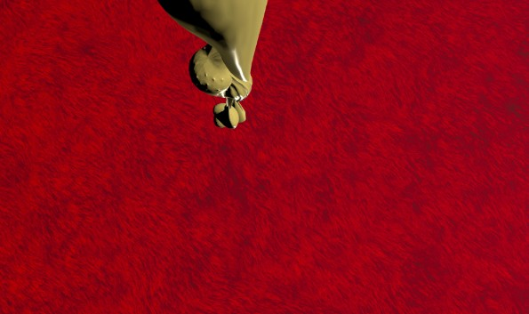]()
